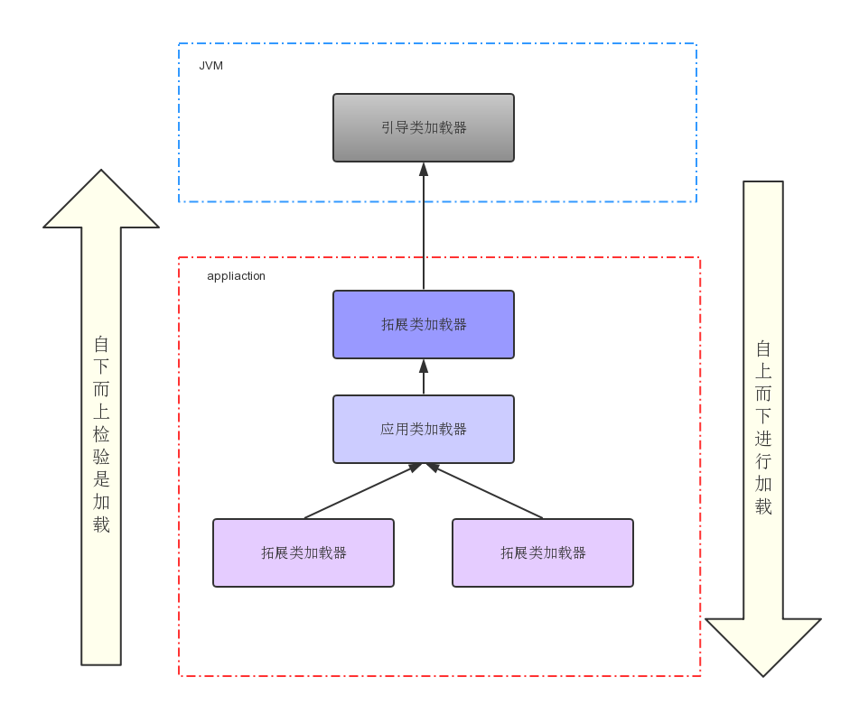

### ClassLoad解析

>     Java的设计初衷是主要面向嵌入式领域，对于自定义的一些类，考虑使用依需求加载原则，即在程序使用到时才加载类，节省内存消耗，这时即可通过类加载器来动态加载。

<br>类加载器在实际使用中给我们带来的好处是，它可以使Java类动态地加载到JVM并运行，即可在程序运行时再加载类，提供了很活的动态加载方式。

学习:
* [x] 类的加载
* [x] 认识双亲委派模型
* [x] 自定义类加载
* [ ] 动态加载的实现
#### 1.类的加载

ClassLoad是Java的核心组件,class都是由ClassLoad加载，把.class二进制文件读入到虚拟机，然后虚拟机进行连接和初始化的操作。


可以看到类的加载是在**装载**的时候进行的,装载之后的流程占时不做讲解

#### 2.双亲委派模型

> **提示:** 在我理解双亲的意思是父类的意思(委派给父类处理),因为通过源码可以了解到实际是把加载请求给父类先处理

 **类加载器种类:**
* 引导类加载器(bootstrap class loader): 主要加载\$JAVA_HOME$\/jre\/lib下面的核心类库。它比较特殊,它并不是继承java.lang.ClassLoad类实现的，而是通过底层C\C++实现的。
* 拓展类加载器(Extension ClassLoader):主要是加载\$JAVA_HOME$\/jre\/lib\/ext的一些拓展类库
* 应用类加载器(Application  ClassLoader):也叫做系统类加载器负责加载用户指定类库。
  
  

**再结合源码来共同看一下:**
``````java
public abstract class ClassLoader {
    ......
    protected Class<?> loadClass(String name, boolean resolve)
        throws ClassNotFoundException
    {
        //获取加载该类的锁
        synchronized (getClassLoadingLock(name)) {
            // 校验是否早已加载过
            Class<?> c = findLoadedClass(name);
            if (c == null) {
                long t0 = System.nanoTime();
                try {
                    if (parent != null) {
                        //父类加载器
                        c = parent.loadClass(name, false);
                    } else {
                        //调用Bootstrap类加载器
                        c = findBootstrapClassOrNull(name);
                    }
                } catch (ClassNotFoundException e) {
                    // ClassNotFoundException thrown if class not found
                    // from the non-null parent class loader
                }
                //父类加载器未加载
                if (c == null) {
                    // If still not found, then invoke findClass in order
                    // to find the class.
                    long t1 = System.nanoTime();
                    //当前类加载器进行加载
                    c = findClass(name);

                    // this is the defining class loader; record the stats
                    sun.misc.PerfCounter.getParentDelegationTime().addTime(t1 - t0);
                    sun.misc.PerfCounter.getFindClassTime().addElapsedTimeFrom(t1);
                    sun.misc.PerfCounter.getFindClasses().increment();
                }
            }
            if (resolve) {
                //解析类
                resolveClass(c);
            }
            return c;
        }
    }
    .......
}
``````
1. 控制每个类的加载只有一个线程在加载
2. 调用底层看该内是否已经被加载过,如果被加载过直接返回该class对象
3. 查看该ClassLoad是否有父类如果有,递归调用父类的classLoad(name)方法
4. 直到父类为空会直接调用底层引导类加载器
5. 若引导类加载器未加载成功则调下一级类加载器,直到用户类加载器来加载此类

**双亲委派的好处**

- 不同层次的类可以由不同的ClassLoad进行加载,有利于系统的模块化
- 可以保护核心类的加载不受冲突影响(**以后再做解释**)

**双亲委派的存在的问题**

- ClassLoad的双亲委派是单向的,这样就存在一个问题,应用类加载系统核心类是没有问题的，但是如果核心类想要加载应用类呢(例如SPI有兴趣的可以了解下等)例如系统提供接口,应用来实现接口

**上下文类加载器(Thread.getContextClassLoader):**

    该类加载器,可以从该线程中获取应用类加载器来加载SPI的实现类。

当核心类库需要加载spi的实现类,它不能使用加载该核心类的加载器去加载用户的类加载器,所以需要从当前线程中去获取对应的应用类加载器

**结合源码再来看下:**
``````java 
public final class ServiceLoader<S>
    implements Iterable<S>
{
    //SPI的类加载方法
    public static <S> ServiceLoader<S> load(Class<S> service) {
        //获取上下文类加载器
        ClassLoader cl = Thread.currentThread().getContextClassLoader();
        return ServiceLoader.load(service, cl);
    }
    public static <S> ServiceLoader<S> load(Class<S> service,ClassLoader loader)
    {
        return new ServiceLoader<>(service, loader);
    }

    private ServiceLoader(Class<S> svc, ClassLoader cl) {
        service = Objects.requireNonNull(svc, "Service interface cannot be null");
        //获取的是系统类加载器 来进行应用类的加载
        loader = (cl == null) ? ClassLoader.getSystemClassLoader() : cl;
        acc = (System.getSecurityManager() != null) ? AccessController.getContext() : null;
        reload();
    }
}

``````

**猜想:** 至于为什么要从线程中获取默认的系统类加载器,而不是直接调用getSystemClassLoader()去加载，可能是因为不同的类加载器加载的同一个class,(JVM认为)他们是不同的对象

#### 3.自定义类加载
实现ClassLoad类:
``````java
public class CustomClassLoad extends ClassLoader{
    @Override
    protected Class<?> loadClass(String name, boolean resolve) throws ClassNotFoundException {
        synchronized (super.getClassLoadingLock(name)) {
                    long t0 = System.nanoTime();
                    Class<?> c = findLoadedClass(name);
                    long t1 = System.nanoTime();
                    c = findClass(name);
                    // this is the defining class loader; record the stats
                    sun.misc.PerfCounter.getParentDelegationTime().addTime(t1 - t0);
                    sun.misc.PerfCounter.getFindClassTime().addElapsedTimeFrom(t1);
                    sun.misc.PerfCounter.getFindClasses().increment();
            if (resolve) {
                resolveClass(c);
            }
            return c;
        }
    }
}
``````
该类是一个简单实现主要是如果只使用当前ClassLoad进行加载,占时一个简单易理解的实现,后续可能会更新tomcat的ClassLoad实现

#### 4.动态加载的实现

后续更新


