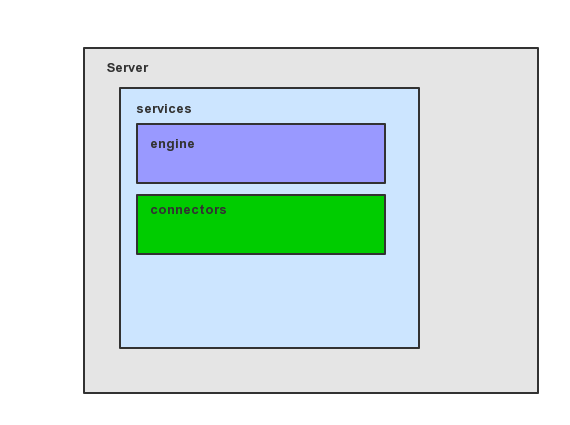

### tomcat启动和停止流程源码分析

> 作为tomcat服务器的启动的入口,也是我们分析源码的切入口,因为tomcat的组件比较明确说以相对来说还是很好分析的。

学习:

* [x] tomcat的组件 
* [x] 启动和停止源码的调用 
* [x] 如何优雅的关闭服务

#### 1.tomcat的组件 

这个会随着源码的分析一步步完善这个架构图



**现在我们所能看到的就是:**
* Server组件: 主要负责所有组件的生命周期控制,开启8005端口让其远程访问关闭服务,初始化一些全局的配置
* Service组件:
  
``````java
public final class StandardServer extends LifecycleMBeanBase implements Server {
    //可以看到再启动的时候会有多个service启动
    @Override
    protected void startInternal() throws LifecycleException {

        fireLifecycleEvent(CONFIGURE_START_EVENT, null);
        setState(LifecycleState.STARTING);

        globalNamingResources.start();

        // Start our defined Services
        synchronized (servicesLock) {
            for (int i = 0; i < services.length; i++) {
                services[i].start();
            }
        }
    }
}
``````
* connector组件:
  
``````java
public class StandardService extends LifecycleMBeanBase implements Service {
    @Override
    protected void startInternal() throws LifecycleException {
        ...
        // Start our defined Container first
        if (engine != null) {
            synchronized (engine) {
                engine.start();
            }
        }
        ...
        //启动多个connector
        synchronized (connectorsLock) {
            for (Connector connector: connectors) {
                // If it has already failed, don't try and start it
                if (connector.getState() != LifecycleState.FAILED) {
                    connector.start();
                }
            }
        }
    }
}
``````
#### 2.启动和停止源码的调用 

[启动源码分析](tomcat启动源码调用.md)

#### 3.如何优雅的关闭服务

通过上面的源码阅读完了。我们也了解到大致流程。对于程序的优雅关闭可能我们并没有去认真想过,在退出时进行操作:
``````java
public class CloseProcedure {
    private static final ShutdownHook shutdownHook = new ShutdownHook();
    public static void main(String[] args) {
        //其实这个钩子在程序退出的时候使用这个线程进行一个处理
        Runtime.getRuntime().addShutdownHook(shutdownHook);
        System.out.println("开始服务");
        try {
            Thread.sleep(1000);
        } catch (InterruptedException e) {
            e.printStackTrace();
        }
    }
     static class ShutdownHook extends Thread {
        @Override
        public void run() {
            serverStop();
        }
    }

    private static void  serverStop(){
        System.out.println("优雅退出");
    }

}
``````


